# 📐 Diagram Arsitektur Sistem — Platform Digital UKM KSEI RIIEF

**Pengembangan Platform Digital Terintegrasi untuk Optimalisasi Manajemen Organisasi dan Evaluasi Keaktifan Anggota UKM KSEI RIIEF**

> UIN Raden Intan Lampung

---

## 1. Arsitektur High-Level (Overview)

Sistem ini menggunakan arsitektur **3-Tier Client-Side** dengan Firebase Firestore sebagai backend realtime.

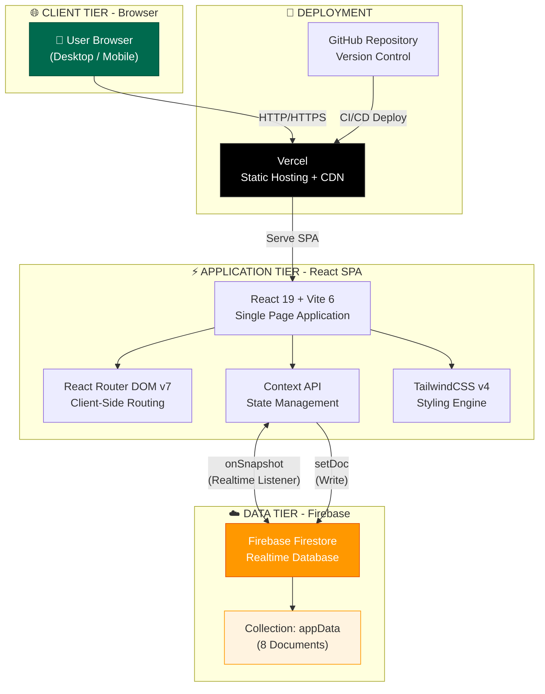

---

## 2. Tech Stack & Build Pipeline

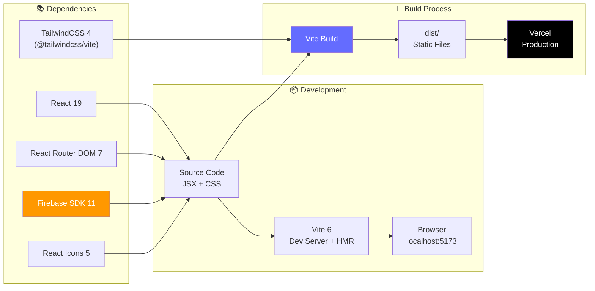

| Layer | Teknologi | Versi | Fungsi |
|-------|-----------|-------|--------|
| **UI Framework** | React | 19.0 | Komponen interaktif & rendering |
| **Build Tool** | Vite | 6.0 | Bundling, HMR, optimasi |
| **Styling** | TailwindCSS | 4.0 | Utility-first CSS framework |
| **Routing** | React Router DOM | 7.0 | Navigasi SPA client-side |
| **Database** | Firebase Firestore | 11.10 | Realtime NoSQL database |
| **Icons** | React Icons | 5.4 | Icon library + Emoji |
| **Font** | Plus Jakarta Sans | - | Google Fonts typography |
| **Hosting** | Vercel | - | Static deployment + CDN |
| **VCS** | GitHub | - | Version control |

---

## 3. Component Tree (React)

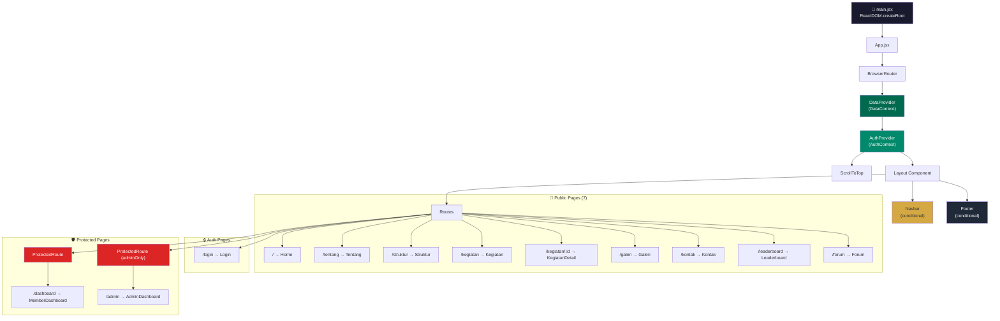

> [!NOTE]
> **Layout Conditional**: Navbar & Footer **disembunyikan** pada halaman `/login` dan `/admin`. Admin Dashboard memiliki sidebar navigasi sendiri.

---

## 4. Arsitektur Data Layer & Firebase Integration

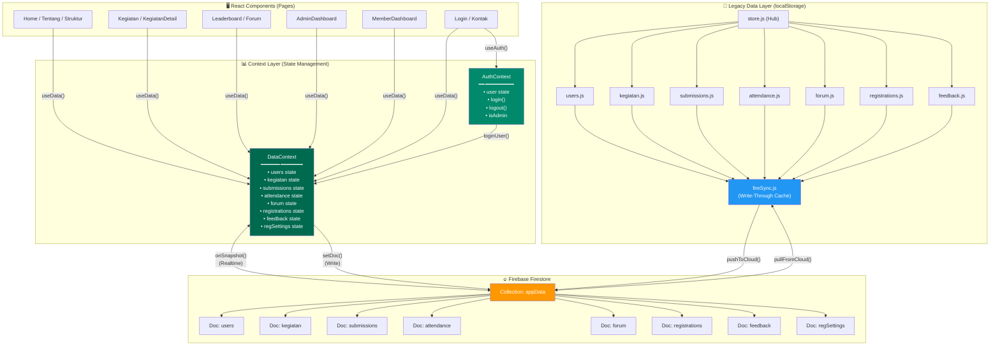

### Pola Sinkronisasi Data (Dual-Mode)

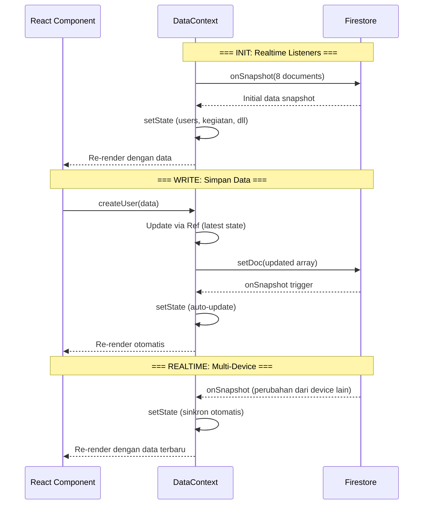

> [!IMPORTANT]
> **DataContext** menggunakan dua pendekatan:
> 1. **Primary (Aktif)**: Langsung `onSnapshot` + `setDoc` ke Firestore — digunakan oleh semua komponen React via `useData()` hook
> 2. **Legacy (Backup)**: `store.js` + `fireSync.js` dengan localStorage sebagai cache — masih ada di codebase tapi tidak dipakai secara aktif oleh React components

---

## 5. Alur Autentikasi & Otorisasi

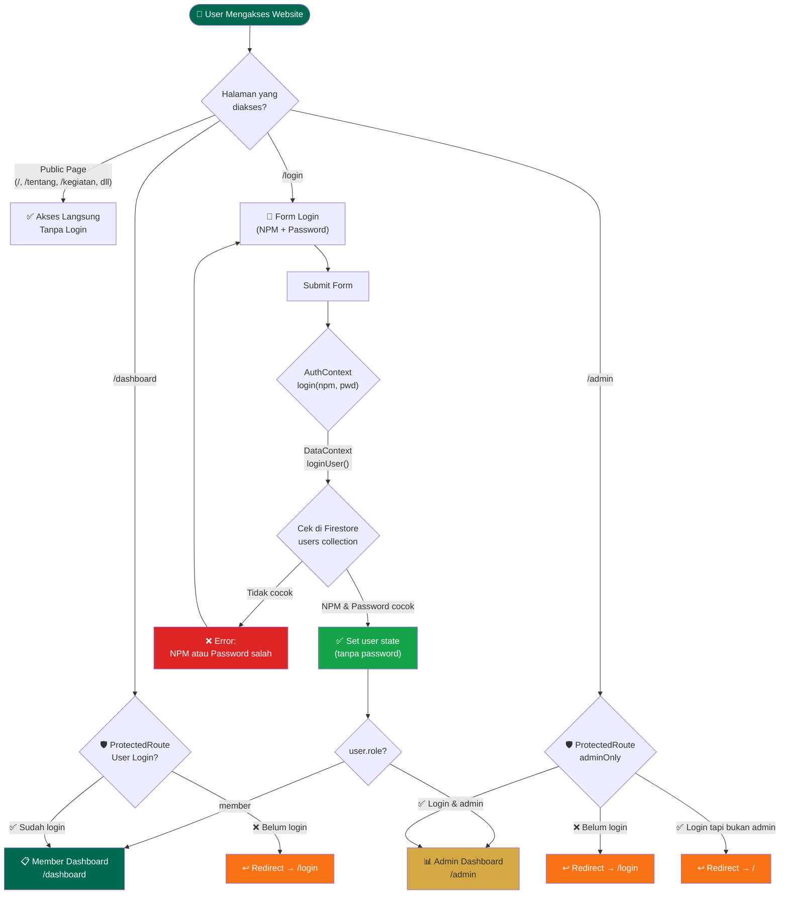

### Tabel Role & Akses

| Halaman | Public | Member | Admin |
|---------|:------:|:------:|:-----:|
| Beranda, Tentang, Struktur | ✅ | ✅ | ✅ |
| Kegiatan (list & detail) | ✅ | ✅ | ✅ |
| Leaderboard | ✅ | ✅ | ✅ |
| Forum (baca) | ✅ | ✅ | ✅ |
| Forum (posting/reply) | ❌ | ✅ | ✅ |
| Kerjakan Quiz | ❌ | ✅ | ✅ |
| Input Absensi | ❌ | ✅ | ✅ |
| Pendaftaran (form) | ✅ | ✅ | ✅ |
| Member Dashboard | ❌ | ✅ | ❌ |
| Admin Dashboard | ❌ | ❌ | ✅ |

---

## 6. Routing Map

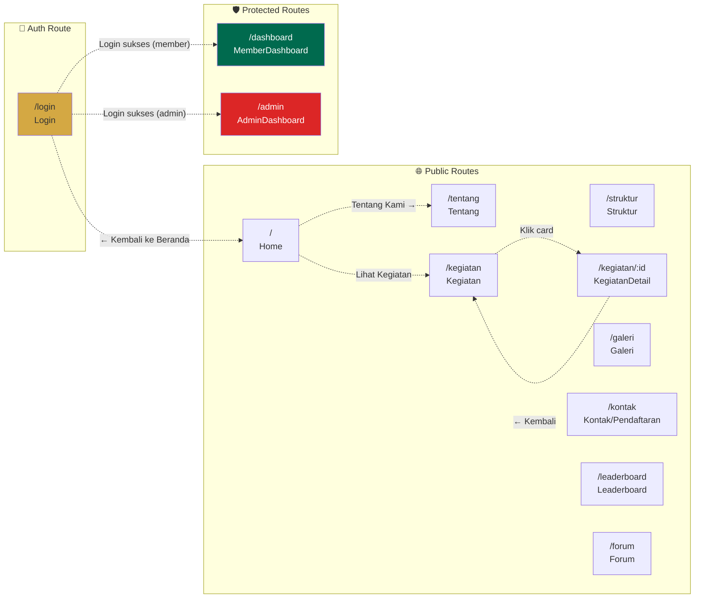

### Layout Rendering

| Route | Navbar | Footer | Layout Khusus |
|-------|:------:|:------:|---------------|
| `/` sampai `/forum` | ✅ | ✅ | Standard Layout |
| `/login` | ❌ | ❌ | Full-screen centered card |
| `/admin` | ❌ | ❌ | Sidebar + Top Header sendiri |
| `/dashboard` | ✅ | ✅ | Standard Layout |

---

## 7. Data Model — Firebase Firestore

Semua data disimpan dalam satu **collection `appData`** dengan **8 document**, masing-masing menyimpan field `items` (array) dan `updatedAt`.

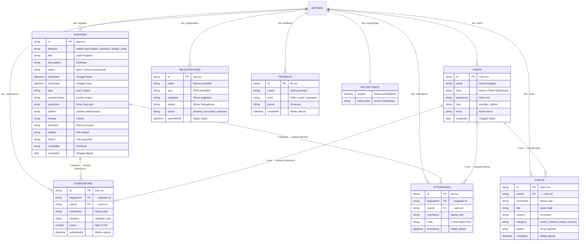

### Struktur Penyimpanan Firestore

```
Firestore Database
└── 📁 Collection: appData
    ├── 📄 users         → { items: [...], updatedAt: "ISO" }
    ├── 📄 kegiatan      → { items: [...], updatedAt: "ISO" }
    ├── 📄 submissions   → { items: [...], updatedAt: "ISO" }
    ├── 📄 attendance    → { items: [...], updatedAt: "ISO" }
    ├── 📄 forum         → { items: [...], updatedAt: "ISO" }
    ├── 📄 registrations → { items: [...], updatedAt: "ISO" }
    ├── 📄 feedback      → { items: [...], updatedAt: "ISO" }
    └── 📄 regSettings   → { isOpen: true, waNumber: "..." }
```

---

## 8. Alur Fitur Utama

### 8.1 Alur Quiz (Materi & Soal)

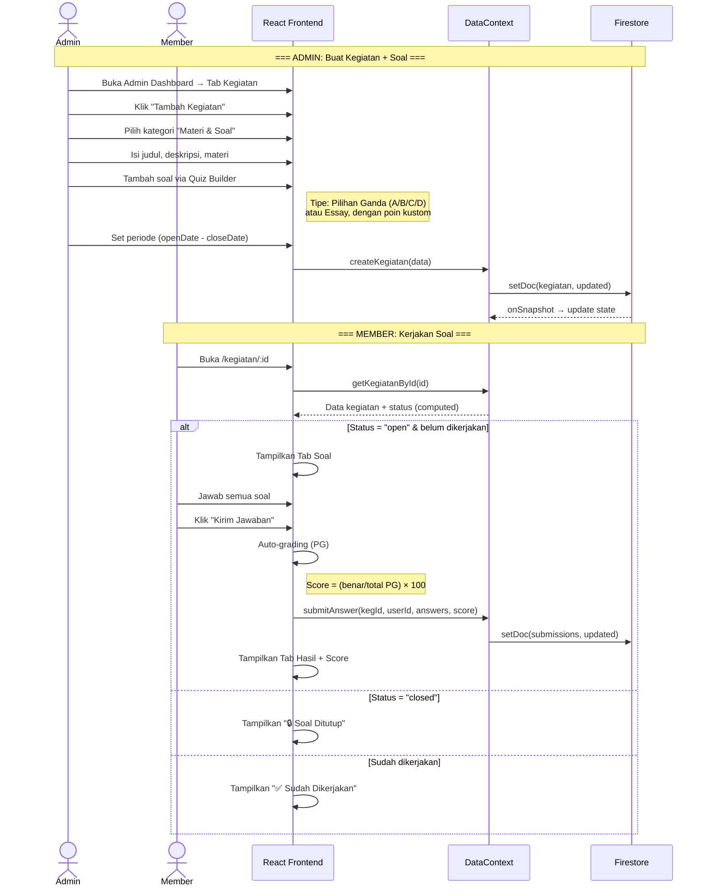

### 8.2 Alur Absensi Digital

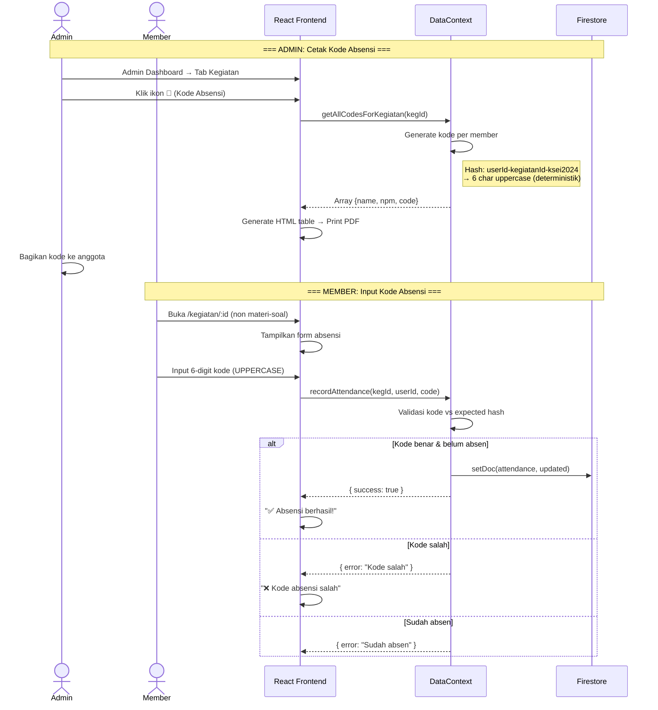

### 8.3 Alur Sistem Gamifikasi & Poin

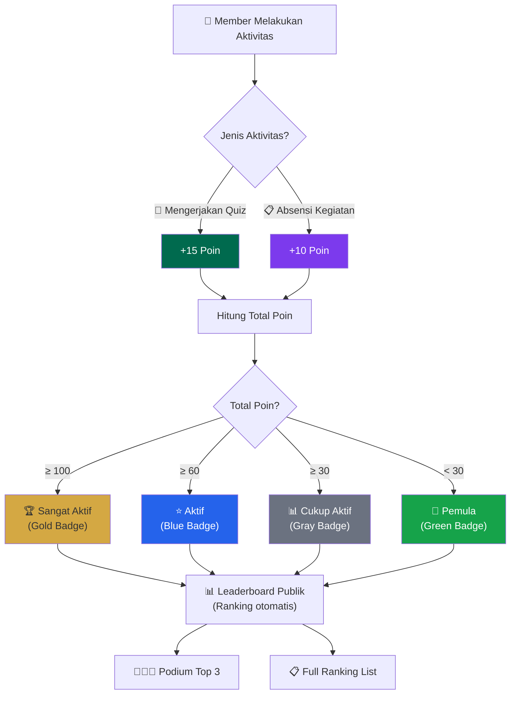

---

## 9. State Management — Context API

```mermaid
graph TB
    subgraph "DataContext (Global State)"
        direction TB
        S1["📊 State Data"]
        S2["users: User[]"]
        S3["kegiatan: Kegiatan[]"]
        S4["submissions: Submission[]"]
        S5["attendance: Attendance[]"]
        S6["forum: Topic[]"]
        S7["registrations: Registration[]"]
        S8["feedback: Feedback[]"]
        S9["regSettings: RegSettings"]
        S10["loading: boolean"]
        S1 --- S2 & S3 & S4 & S5 & S6 & S7 & S8 & S9 & S10
    end

    subgraph "DataContext Functions (28 total)"
        direction TB
        F1["👤 User (4):<br/>loginUser, createUser,<br/>updateUser, deleteUser"]
        F2["📋 Kegiatan (4):<br/>getKegiatanById, createKegiatan,<br/>updateKegiatan, deleteKegiatan"]
        F3["📝 Submissions (4):<br/>getSubmissionsByKegiatan,<br/>getSubmissionsByUser,<br/>getUserSubmission, submitAnswer"]
        F4["📋 Attendance (5):<br/>getAttendanceByKegiatan,<br/>getUserAttendance, recordAttendance,<br/>getAllCodesForKegiatan,<br/>generateAttendanceCode"]
        F5["💬 Forum (3):<br/>getTopicById, createTopic,<br/>addReply, deleteTopic"]
        F6["📝 Registrations (4):<br/>submitRegistration,<br/>updateRegStatus,<br/>deleteRegistration,<br/>toggleRegistration"]
        F7["📣 Feedback (2):<br/>submitFeedback,<br/>deleteFeedback"]
    end

    subgraph "AuthContext"
        A1["user: User | null"]
        A2["login(npm, pwd): Result"]
        A3["logout(): void"]
        A4["isAdmin: boolean"]
    end

    style S1 fill:#006a4e,color:#fff
    style A1 fill:#00896a,color:#fff
```

### Ref Pattern untuk Stale Closure Prevention

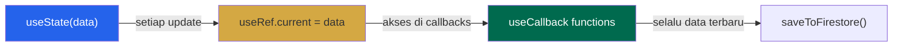

> [!TIP]
> DataContext menggunakan pattern `useRef` + `useCallback` untuk menghindari **stale closure** — semua fungsi CRUD mengakses data terbaru via `usersRef.current` bukan `users` state langsung. Ini mencegah race condition saat data sering berubah.

---

## 10. Deployment Architecture

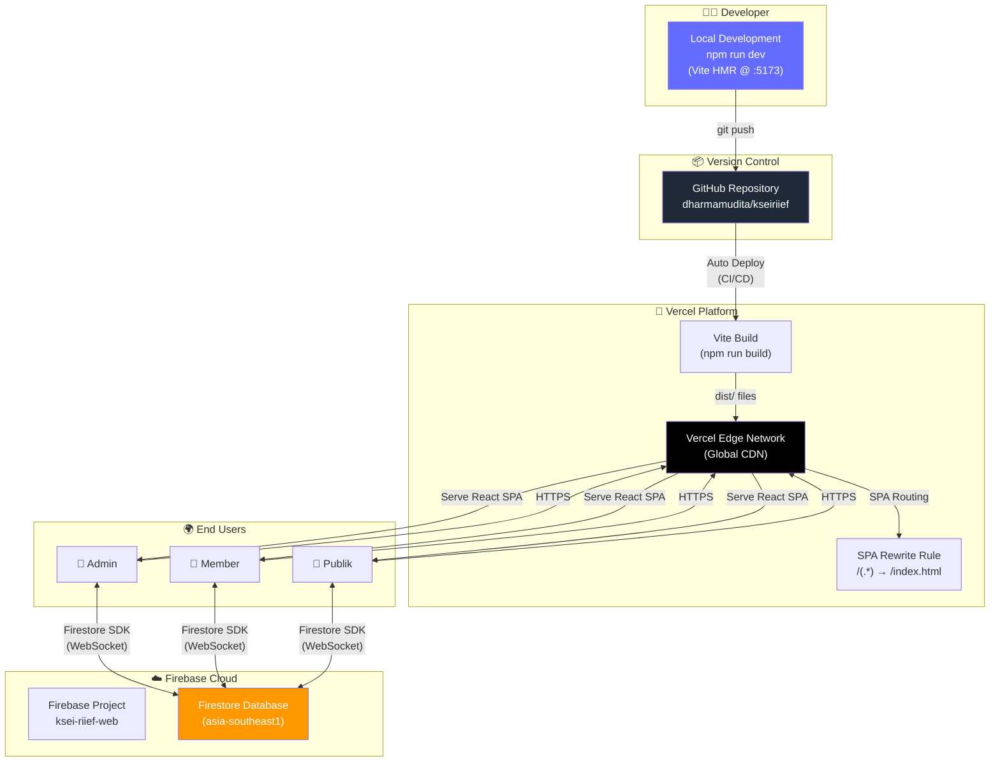

### Konfigurasi Deployment

```json
// vercel.json — SPA Routing
{
  "rewrites": [{ "source": "/(.*)", "destination": "/" }]
}
```

```javascript
// vite.config.js — Build Configuration
import { defineConfig } from 'vite'
import react from '@vitejs/plugin-react'
import tailwindcss from '@tailwindcss/vite'

export default defineConfig({
  plugins: [react(), tailwindcss()]
})
```

---

## 11. Arsitektur Admin Dashboard (Internal)

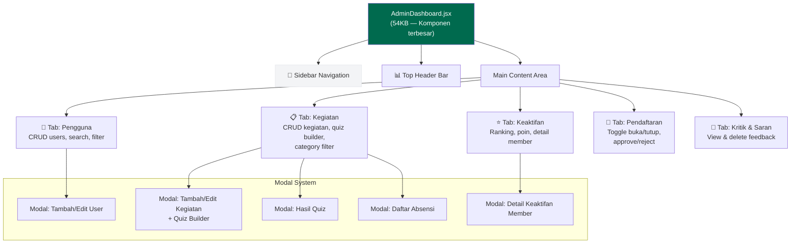

---

## 12. Ringkasan Arsitektur

| Aspek | Detail |
|-------|--------|
| **Pattern** | Single Page Application (SPA) |
| **Rendering** | Client-Side Rendering (CSR) |
| **State** | React Context API (DataContext + AuthContext) |
| **Database** | Firebase Firestore (Realtime, NoSQL) |
| **Sync** | `onSnapshot` listeners (8 docs) + `setDoc` writes |
| **Auth** | Custom auth via Firestore (NPM + Password) |
| **Routing** | Client-side dengan React Router DOM v7 |
| **Styling** | TailwindCSS v4 (utility-first, @theme config) |
| **Build** | Vite 6 dengan HMR |
| **Deploy** | Vercel (auto dari GitHub) |
| **Total Pages** | 12 halaman (7 publik + 1 auth + 2 protected + 1 galeri + 1 detail) |
| **Total Firestore Docs** | 8 documents dalam 1 collection |
| **Total Context Functions** | 28 fungsi CRUD + utility |

---

*Dokumen ini dibuat berdasarkan analisis langsung terhadap source code project KSEI RIIEF.*
